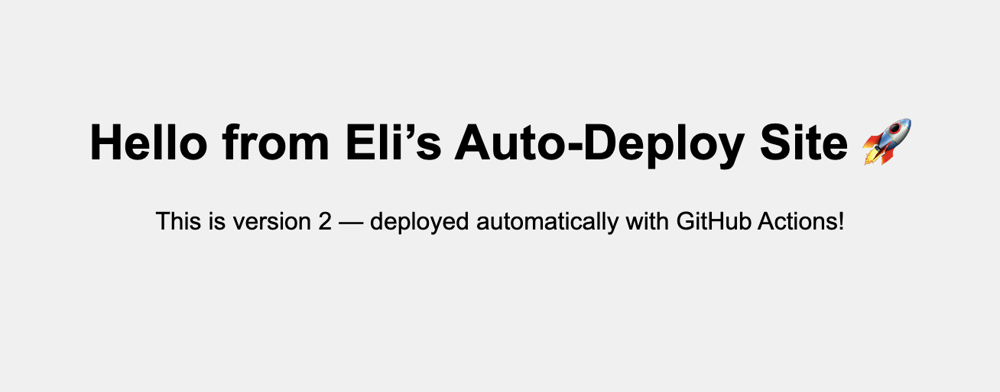

Auto Deploy Static Site 🚀
Live Demo:
🌐 https://eli-sep.github.io/auto-deploy-static-site/

📌 Overview
This project demonstrates a fully automated static website deployment pipeline using GitHub Actions and GitHub Pages. Every time a change is pushed to the main branch, GitHub Actions builds and publishes the site live using the gh-pages branch — with zero manual steps required.

This project also features a clean dev → main Git workflow for safe development and testing.

🛠 Technologies Used
HTML & CSS – Static site content

Git & GitHub – Version control and repo hosting

GitHub Actions – CI/CD workflow automation

GitHub Pages – Static site hosting

Nano/Vim – Command line editing for commits

Branching (dev/main) – Safe Git workflow management

📁 Project Structure
auto-deploy-static-site/
├── index.html
├── styles.css
└── .github/
  └── workflows/
    └── deploy.yml

🔄 Workflow Summary
Code is developed in the dev branch

When ready, changes are merged into main

GitHub Actions triggers a workflow

The workflow pushes the deploy-ready code to the gh-pages branch

GitHub Pages serves the site publicly from the gh-pages branch

⚙️ GitHub Actions Workflow Highlights
Triggers on every push to main

Uses peaceiris/actions-gh-pages to deploy

Publishes directly from the root directory (./)

Deploys to the gh-pages branch using the GitHub token

👤 Author
Built by @eli-sep –
My first DevOps-style GitHub project, featuring automated CI/CD, branching strategies, version control, and a fully live auto-updating site.